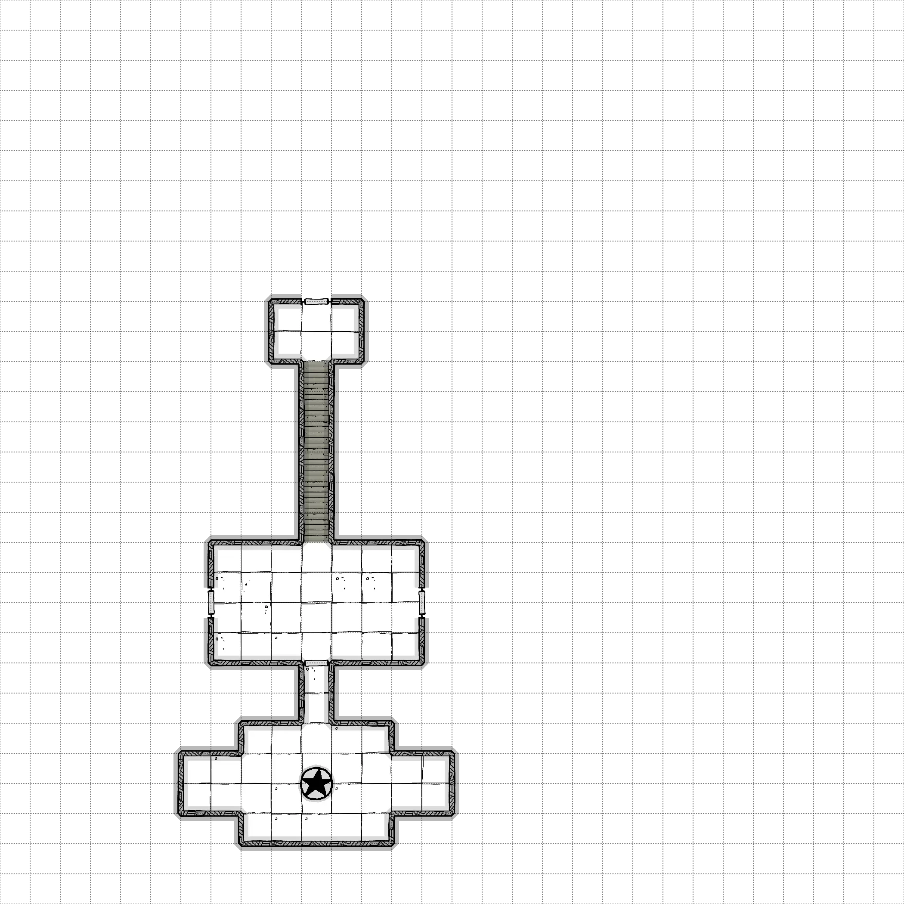

# January

 
1. The door to this room opens easily, despite its obvious weight. Inside is revealed a room with no light, apart from
what streams from the outside. The stone walls are dump and cold to the touch. The floor is covered with muddy, clawed
footprints. There is a stone staircase that descends 30' into the darkness below.

2. This room is covered with more muddy footprints that lead in all directions, there are three doors leading to the 
south, east, and west. There are runes carved in dwarven that have been defaced with rude graffiti in both goblin
and kobold. In the northeast corner of the room is a kobold corpse. If a character comes next to the corpse they 
disturb a **swarm of rot grubs**. The corpse has a belt pouch with 25sp.

3. This room is dominated by a large statue of an ancient dwarven hero. Vandals have removed the nose and one of the arms
from the statue, as well as the inscription on the base. A passive perception 14 reveals that the plaque that serves as
the inscription can be slid to the side, revealing a compartment with golden key as well as a set of fine stone carving tools